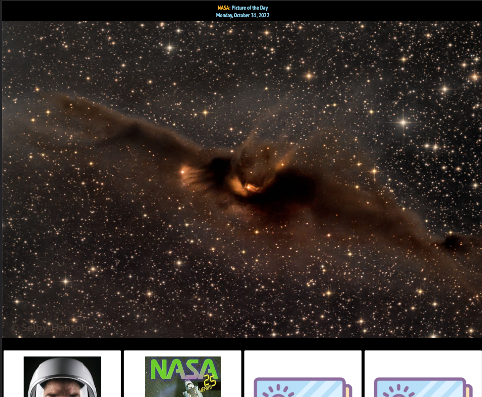
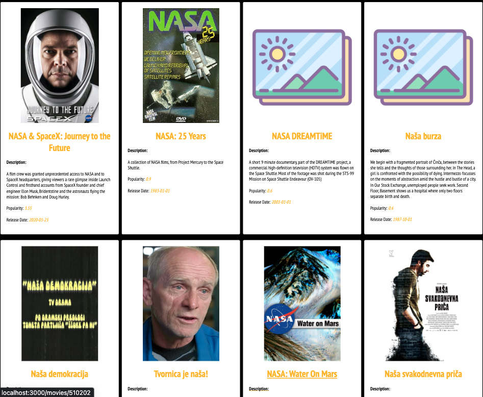
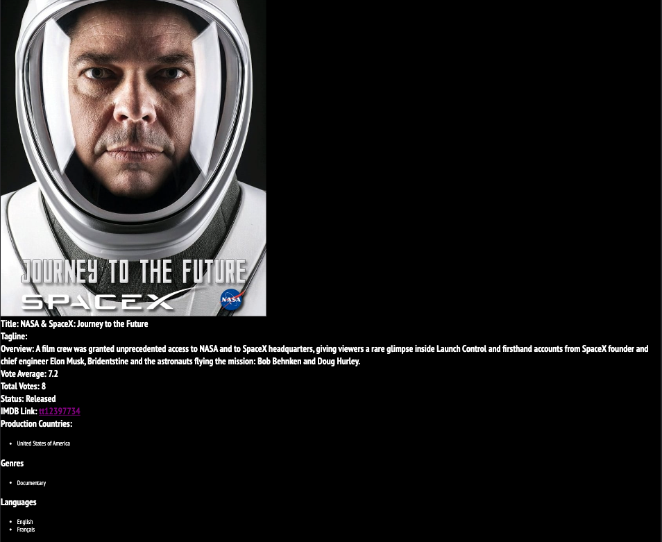

# Getting Started with Create React App

This project was bootstrapped with [Create React App](https://github.com/facebook/create-react-app).

## Demo
 

## Available Scripts

In the project directory, you can run:

### `npm start`

Runs the app in the development mode.\
Open [http://localhost:3000](http://localhost:3000) to view it in your browser.

The page will reload when you make changes.\
You may also see any lint errors in the console.

## Few Things to Be Mindful of;

The project wont run out of the bat as you need an env file,
In order to get everything to work, you need to do the following;

### Create a .env file in the root of the project

### in this file, add 2 variables with names `REACT_APP_NASA_API_KEY` and `REACT_APP_TMDB_API_KEY` 

### Restart the server, and open [http://localhost:3000](http://localhost:3000)

### `npm run build`

Builds the app for production to the `build` folder.\
It correctly bundles React in production mode and optimizes the build for the best performance.

The build is minified and the filenames include the hashes.\
Your app is ready to be deployed!

See the section about [deployment](https://facebook.github.io/create-react-app/docs/deployment) for more information.

